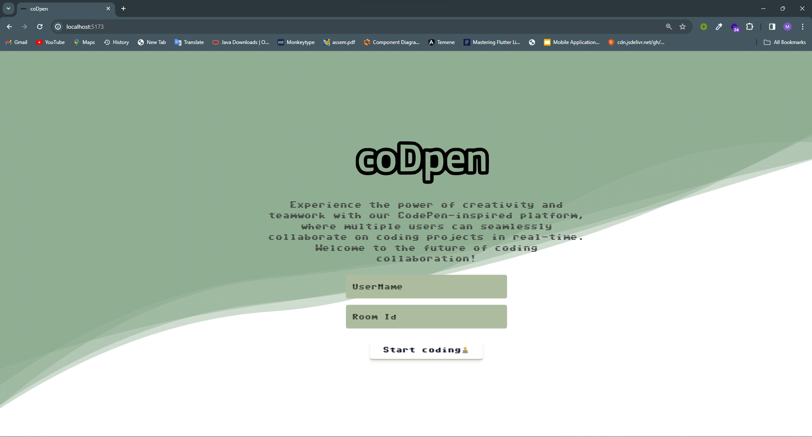
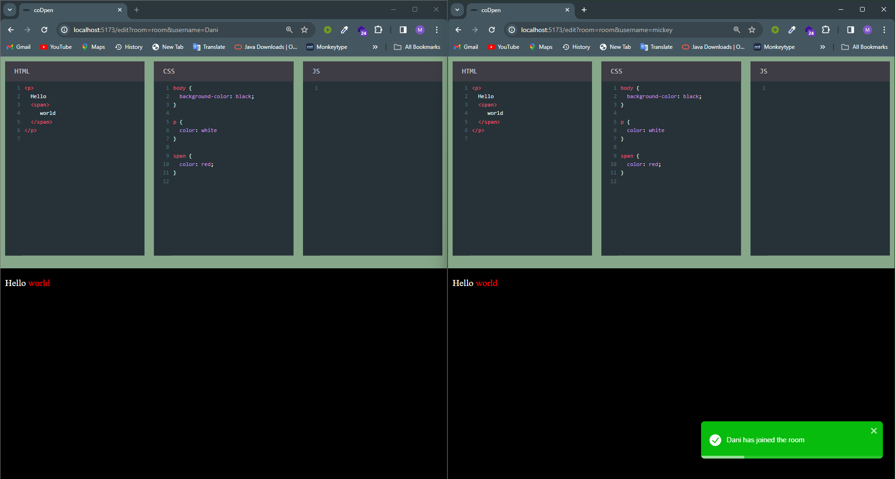

# Collaborative Code Editor
## Welcome to <span style="font-size: larger;"><span style="font-size: larger;">`coDpen`</span></span>





## WebSockets in <span style="font-size: larger;">`coDpen`</span>

### Real-time Communication

WebSockets are at the core of <span style="font-size: larger;">`coDpen`</span>'s real-time communication infrastructure. They enable instant and bidirectional communication between the server and clients, ensuring that changes made by one user are immediately reflected on the screens of all collaborators. This real-time synchronization enhances the collaborative coding experience, making it feel as if everyone is working in the same room.

### Efficient Code Synchronization

With WebSockets, <span style="font-size: larger;">`coDpen`</span> efficiently synchronizes code changes among users. Each keystroke, edit, or addition is instantly broadcasted to connected clients, allowing for smooth and near-instantaneous updates. This ensures that all collaborators stay in sync, even when working on different sections of the codebase.

### Presence Awareness

WebSockets play a crucial role in maintaining presence awareness within <span style="font-size: larger;">`coDpen`</span>. Users can see each other's edits in real-time, promoting a sense of collaboration and teamwork. The presence awareness feature helps prevent conflicts by allowing users to be aware of who is actively editing the code.

## CRDT and WOOT Algorithm 

### CRDT (Conflict-free Replicated Data Type)

We leverage CRDT, or Conflict-free Replicated Data Type, to enhance the collaborative editing experience in <span style="font-size: larger;">`coDpen`</span>. CRDT is a crucial concept for distributed systems where nodes need to maintain consistent data across different replicas. CRDTs, by design, ensure that even in the face of network partitions and concurrent updates, replicas can converge to a consistent state without conflicts.

In <span style="font-size: larger;">`coDpen`</span>, CRDT plays a pivotal role in maintaining consistency across distributed systems. Here's how CRDT handles various consistency aspects:

- **Conflict Resolution:** CRDTs excel at conflict resolution, ensuring that even if users are making simultaneous edits to shared content, the system can merge these changes without conflicts.

- **Casual Consistency:** CRDTs provide a form of casual consistency, striking a balance between strong consistency and eventual consistency. This allows for more flexibility in the timing and order of operations, making it well-suited for collaborative environments where users may be working independently on different parts of a document.

- **Convergence:** CRDTs guarantee convergence, meaning that all replicas will eventually reach the same state, regardless of the order in which updates are applied or the network conditions. This ensures a consistent and coherent view of the shared document.

### WOOT Algorithm

WOOT (WithOut Operational Transformation) is a fundamental algorithm that we've integrated into <span style="font-size: larger;">`coDpen`</span>. It is designed for achieving consistency in distributed systems, specifically in collaborative editing scenarios. The WOOT algorithm enables multiple users to concurrently edit a shared document without the need for a central server to coordinate changes. WOOT ensures that operations are commutative, allowing users to make changes independently, and the order of application does not affect the final result.

The WOOT algorithm integrated into <span style="font-size: larger;">`coDpen`</span> complements CRDT by addressing specific consistency challenges in collaborative editing scenarios:

- **Commutativity:** WOOT ensures that operations are commutative, meaning the order in which users apply changes does not impact the final state of the document. This property allows users to work independently and concurrently without waiting for centralized coordination.

- **Consistency without Central Server:** With WOOT, <span style="font-size: larger;">`coDpen`</span> achieves consistency without relying on a central server to coordinate changes. Users can collaboratively edit a shared document in real-time, irrespective of the presence of a central authority.

- **Efficient Conflict-Free Editing:** WOOT's design facilitates efficient conflict-free editing, allowing users to make changes without the worry of conflicts. The algorithm intelligently handles concurrent edits, ensuring a smooth and conflict-free collaborative editing experience.

### Project Overview

### Features

- **Real-time Collaboration:** <span style="font-size: larger;">`coDpen`</span> allows multiple users to work on HTML, CSS, and JS code simultaneously, with changes reflecting in real-time for all collaborators.
  
- **Multi-Language Support:** The editor supports HTML, CSS, and JS, enabling users to work on different aspects of a web project simultaneously.

- **Golang-Based Server:** The backend is powered by a Golang server, providing a robust and scalable foundation for handling collaborative editing sessions.

- **Golang Client Application:** The Golang-based client application ensures efficient communication with the server and enables users to interact with the collaborative editing platform seamlessly.

- **React-Based Web Client:** The web client, built using React and managed by Yarn, provides a modern and user-friendly interface for code editing and collaboration.

- **Collaborative Text Editing with termBox:** In addition to code, <span style="font-size: larger;">`coDpen`</span> supports collaborative editing of normal text, fostering communication and collaboration among users in real-time. Leveraging the power of termBox, <span style="font-size: larger;">`coDpen`</span> provides a terminal-like interface for text editing, enabling users to collaborate seamlessly on plain text documents. Whether you're brainstorming ideas, taking meeting notes, or working on documentation, the collaborative text editing feature in <span style="font-size: larger;">`coDpen`</span> brings a familiar and efficient experience to your collaborative coding environment.

### Interesting Facts

- <span style="font-size: larger;">`coDpen`</span> is designed to foster creativity and efficiency by allowing developers to code together in real-time, similar to pair programming.

- The integration of the WOOT algorithm and CRDT ensures a conflict-free and consistent editing experience, even in the presence of network challenges.

- We welcome contributions and feedback from the community to enhance and expand the collaborative coding capabilities of <span style="font-size: larger;">`coDpen`</span>.

Feel free to explore and experience the power of collaborative coding with <span style="font-size: larger;">`coDpen`</span>!


## Project Structure


The project is organized into three main folders and also the test files in them:

1. **client**: The Golang-based client application.
    - editor
       - editor.go
       - editor_test.go
    - engine.go
    - main.go
    - ui.go
    - utils.go
2. **commons**
   - message.go
   - operation.go
   - room.go
3. **crdt**
   - crdt.go
   - woot_test.go
   - woot.go
4. **server**
   - main_test.go
   - main.go
   - mongodb.go

## Getting Started

To set up and run the collaborative code editor, follow the steps below:

### 1. Clone the Repository

```bash
git clone https://github.com/dani7514/codpen.git
cd your-repo
```

### 2. Start the Server

Navigate to the `backend` folder and run the following commands:

```bash
cd backend
go run main.go
```

### 3. Run the Golang Client
Navigate to the `client` folder and execute the following commands:

```bash
cd client
go run *.go
```
This will initiate the Golang-based client.

### 4. Launch the React Web Client

Navigate to the client-web folder and install the required dependencies using Yarn:

```bash
cd client-web
yarn install
```

After the installation, start the React web client with:

```bash
yarn start
```

This will launch the web client, providing a user-friendly interface for collaborative coding.

## Contributors

| First Name             | Last Name      | Id                                             |
|------------------------|--------------- |------------------------------------------------|
| Michael                | Gashawtena     | UGR/3575/13                                    |
| Daniel                 | Misganaw       | UGR/6303/13                                    |    
| Zelalem                | Habtamu        | UGR/7301/13                                    |
| Yohannes               | Bekele         | UGR/3361/13                                    |
| Abiy                   | Biru           | UGR/3486/13                                    |

We appreciate their valuable contributions to <span style="font-size: larger;">`coDpen`</span>!

